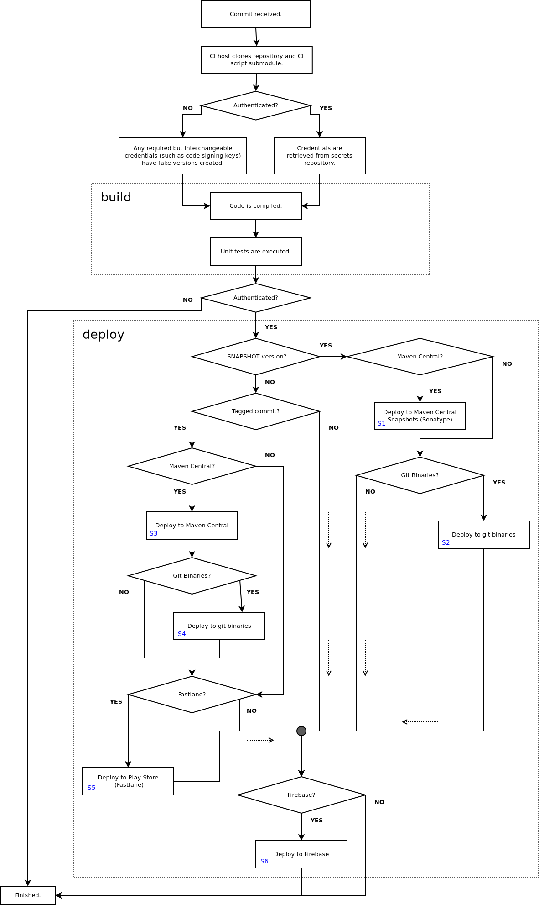

# From Commits To Android Builds

## Overview

This document attempts to describe the _continuous integration_ processes
that produce Android builds of the Palace application.

## CI Scripts

The CI process is implemented entirely in plain [Bash](https://www.gnu.org/software/bash/),
with a strong emphasis on allowing developers to run the scripts on their local
machines for testing purposes. The scripts are maintained in a single
[source repository](https://www.github.com/ThePalaceProject/android-ci) and are imported by all projects
wishing to use them as a [git submodule](https://git-scm.com/book/en/v2/Git-Tools-Submodules).

The main entry point into the script is the `ci-main.sh` script, and this
is typically executed by a [GitHub Action](https://github.com/features/actions).
Currently, each repository defines an action to be executed on each authenticated
commit, and a separate action to be executed on pull requests.

## CI Execution

The execution of the CI scripts can be divided into two phases: _building_
and _deploying_. The _build_ phase compiles all of the code and runs the
test suite, and the _deploy_ phase uploads the produced binaries to various 
different locations depending on the project-specific configuration.
The _deploy_ phase _only_ executes for authenticated commits (and not pull 
requests), because deploying usually requires access to credentials and other 
secrets, and a malicious pull request from a third party could steal those 
secrets. GitHub actions have built-in protections against this, but the CI
scripts are written in an CI-independent manner, and therefore keep 
"executing with credentials" and "executing without credentials" strictly
separated. Given that the execution of a build for a pull request is just
a subset of the execution of a build for an authenticated commit, this
document only goes into detail for the authenticated case.

The full execution of the CI workflow is described by the following graph:

## Build

The _build_ phase requires little explanation: It simply executes a
conventional `./gradlew clean assemble test` command to build the code
and execute the test suite. A _credentials_ step is executed that is
actually controlled by a small project-specific script; it's the responsibility
of this script to copy credentials from an external credentials repository
in to any required locations in the project sources before the build can
proceed.

## Deploy

The _deploy_ phase of the build is more complex and is explained over 
the following sections.

### -SNAPSHOT Versioning

The CI scripts expect projects to follow the Maven convention of having version
numbers that end in `-SNAPSHOT` denote volatile snapshot versions of
packages. The artifacts for a snapshot version of a package can be updated
and/or removed at any time. Snapshot versions are convenient during development,
but release versions should always be using non-snapshot versions (and, ideally,
be only using non-snapshot versions of any dependencies too).

The CI scripts read the _gradle.properties_ file in the root of the project
being built, and extract a `VERSION_NAME` attribute from the properties. If
this version name ends with `-SNAPSHOT`, the build assumes that the package
being built is a snapshot version, and adjusts the _deploy_ behaviour 
accordingly.

### Tagged Commits

If the contents of the current commit are not a [snapshot version](#-snapshot-versioning),
and the commit is [tagged](https://git-scm.com/book/en/v2/Git-Basics-Tagging),
then the CI scripts assume that the package being built should be _released_ 
formally, and adjusts the _deploy_ behaviour accordingly.

### Neither -SNAPSHOT Nor Tag!

If the contents of the current commit are not a [snapshot version](#-snapshot-versioning),
and the commit isn't [tagged](#tagged-commits), then the CI scripts assume 
that someone made a mistake when committing and forgot to change the version
number from the previous release. The CI scripts adjust their behaviour to
only perform a very minimal deployment.

### Error Handling

The _deploy_ phase defers errors to the end of the build. If an individual
step (such as deploying to Maven Central) fails, then all of the steps that
follow will still be executed, but the build as a whole will be marked as failed
at the end of the _deploy_ phase. The reason for this is that deployment
necessarily involves talking to a lot of external systems, and any of those
systems can fail at any time. If the build is allowed to continue in the
face of errors, then this means that the build can be retried manually 
until all of the steps have succeeded.

In practice, it seems to be quite rare for any of the deploy steps to fail,
as all of the external systems seem to be generally reliable.

### Maven Central

Iff all the following are true:

  * The contents of the current commit are a [snapshot version](#-snapshot-versioning)
  * The project is configured to publish artifacts to Maven Central.

... Then then the produced build artifacts are published to the Sonatype Snapshots 
repository. This is a repository hosted in the same place as Maven Central, 
but exclusively holds snapshot artifacts. This is node `S1` on the flow chart.

Iff all the following are true:

  * The contents of the current commit are _not_ a [snapshot version](#-snapshot-versioning).
  * The current commit is [tagged](#tagged-commits).
  * The project is configured to publish artifacts to Maven Central.

... Then the CI scripts use [brooklime](https://www.io7m.com/software/brooklime) 
to perform a full release staging process to Maven Central. This is node `S3` 
on the flow chart.

### Git Binaries

The CI scripts are able to (optionally) deploy binaries to a Git repository.

Iff all the following are true:

  * The contents of the current commit are a [snapshot version](#-snapshot-versioning).
  * The project is configured to publish artifacts to a Git repository. 

... Then the produced artifacts are published to the configured repository. This is
node `S2` on the flow chart.

Iff all the following are true:

  * The contents of the current commit are _not_ a [snapshot version](#-snapshot-versioning).
  * The current commit is [tagged](#tagged-commits).
  * The project is configured to publish artifacts to a Git repository.

... Then the produced artifacts are published to the configured repository. This is
node `S4` on the flow chart.

### Fastlane (Play Store)

The CI process optionally uses [Fastlane](https://fastlane.tools/) to deploy
application builds to the [Play Store](https://play.google.com/store).

Iff all the following are true:

  * The contents of the current commit are _not_ a [snapshot version](#-snapshot-versioning).
  * The current commit is [tagged](#tagged-commits).
  * The project is configured to publish one or more applications using Fastlane.

... Then the CI scripts will install Fastlane locally, and use it to stage a
release of the application to the Play Store. Specifically, the scripts will
upload to the _alpha_ (closed testing) track. This requires a developer to
go into the [Play Console](https://play.google.com/console) and manually
click "Deploy To Production". This is node `S5` on the flow chart.

Deploying an application to the Play Store requires including _release notes_.
The current applications use [changelog](https://www.io7m.com/software/changelog/)
to maintain a `README-CHANGES.xml` file in each project. The build system
automatically generates release notes for the store from this file.

Deploying an application to the Play Store using Fastlane requires a private
key in JSON format, obtained from the Play Console. It also requires API
Access to be enabled in the Play Console. Only the owner of the Play Store
account is able to enable/disable API access. See the
[Fastlane setup documentation](https://docs.fastlane.tools/getting-started/android/setup/)
for information on how these credentials are received. The CI process automates
all the setup steps except for the credentials retrieval. Projects are
expected to copy the required JSON key into the correct location at the
[start of the build](#build).

### Firebase

The CI process optionally uses [Firebase](https://firebase.google.com/) to deploy
application builds to an online repository for testing and QA.

Iff all of the following are true:

  * The project is configured to publish one or more applications using Firebase.

... Then the CI scripts will install Firebase locally, and use it to publish APK
and/or AAB files. Note that this is the only deployment step that doesn't
care about whether a build is a snapshot version, a tagged commit, or something
else. This is node `S6` on the flow chart.

Deploying an application to Firebase requires including _release notes_.
The current applications use [changelog](https://www.io7m.com/software/changelog/)
to maintain a `README-CHANGES.xml` file in each project. The build system
automatically generates release notes from this file.
